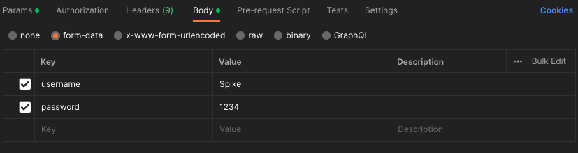
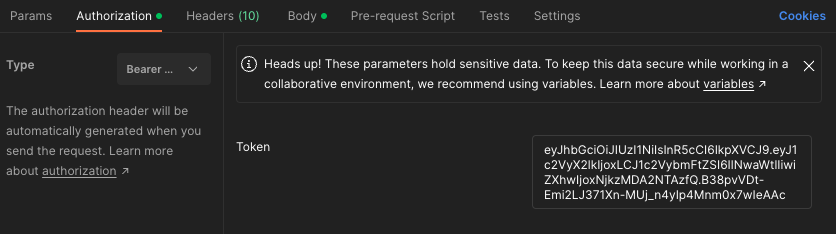

# Login
Implemented using OAuth2 with Password (and hashing), Bearer with JWT tokens
JWT (JSON Web Tokens) token: Anyone could recover the information from the contents, but it's signed. So, when you receive a token that you emitted, you can verify that you actually emitted it.

Reference: 
- https://fastapi.tiangolo.com/tutorial/security/oauth2-jwt/
- https://jwt.io/introduction

## Using Postman to test
### Create user
Send POST request with body in JSON such as
{
    "username": "Spike",
    "password": "1234"
}

### Login
Send POST request with form-data in the body such as

### Access protected endpoint
Add JWT token with type Bearer in Authorization

