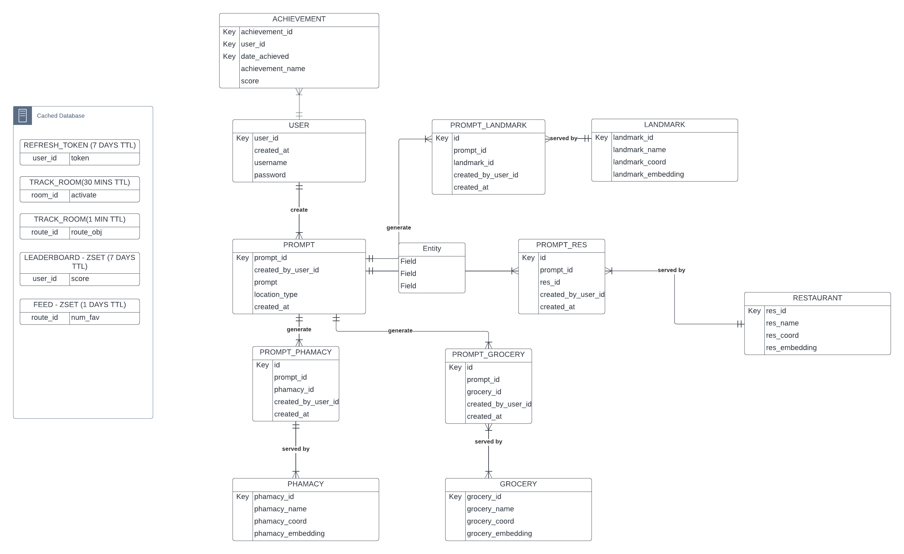

# Database Introduction

The database system combines the strength of PostgreSQL with Redis's rapid in-memory processing.

The **Entity Relationship Diagram (ERD)** visually details the interconnectedness of the database tables.

- **PostgreSQL** serves as the primary database, adept at managing vector-based and geo-spatial queries. For consistent deployment, a Dockerised `ankane/pgvector` image is used alongside the `postgresql-15-postgis-3` geo-spatial extension. The system incorporates **pgvector** for vector operations and **PostGIS** for spatial data insights. Tables are structured using SQLAlchemy and Alembic, the latter ensuring smooth data migrations.

- **Redis**, the secondary in-memory database, focuses on caching and TTL-based data management, speeding up data retrieval and reducing reliance on the primary database. It assists in handling refresh tokens, room PINs, and logs. A layered data-fetching approach prioritizes Redis for speed, falling back on PostgreSQL when necessary.

Together, PostgreSQL and Redis create a reliable and efficient data management backbone, facilitating various functionalities and ensuring smooth operations.

