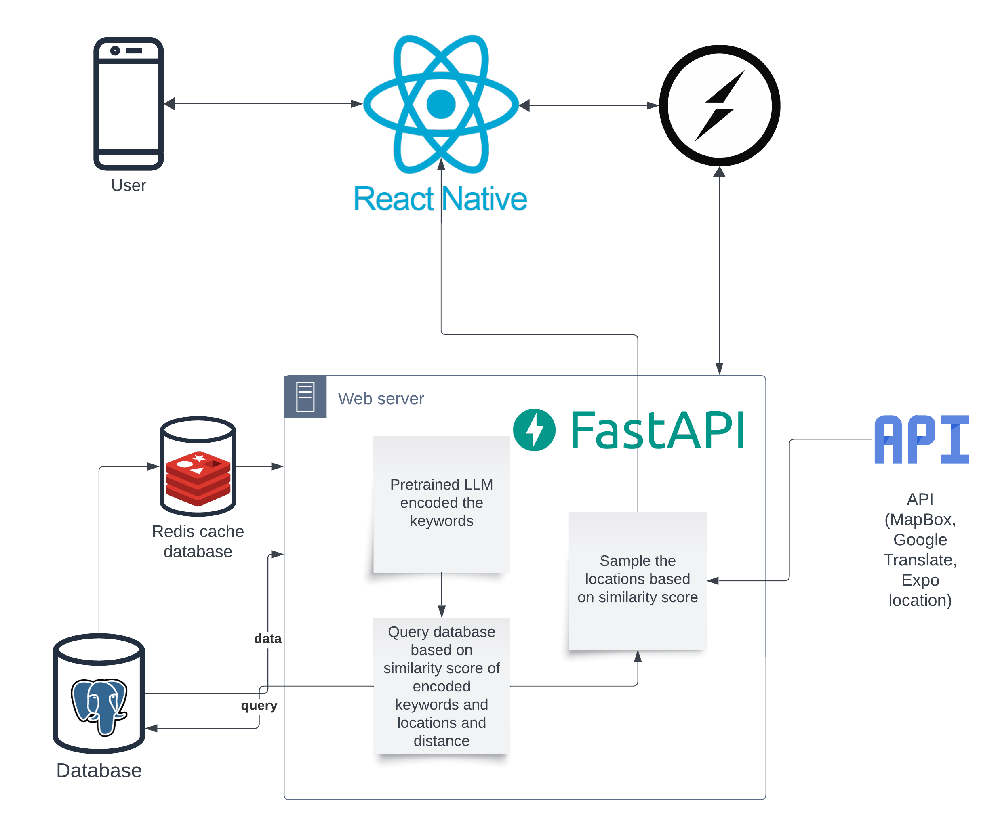

# Introduction

- **Backend**: Explores system operations, from running and testing to deployment and developer actions.
  
- **Frontend**: Describes system operation, shutdown, and deployment procedures.

**Technology Stack**

The frontend uses the **React Native** framework, complemented by tools like **React Native Paper** and a suite of libraries including **Redux** and **Socket.io Client**.

The backend uses the **FastAPI** web framework and employs **PostgreSQL** as the primary database, working with tools such as **SQLALchemy** for efficient data operations.

Integration with external APIs like **MapBox**, **Google Translate**, and **Google Location** enhances functionality. Semantic search capabilities are enhanced by **Huggingface’s Sentence Transformers**, with unit testing via **PyTest**.

