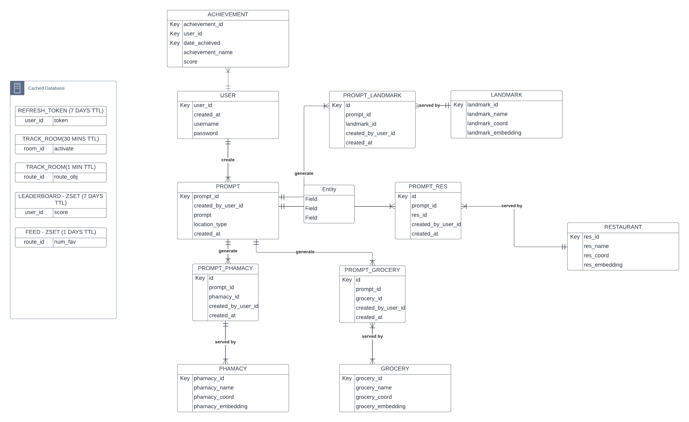
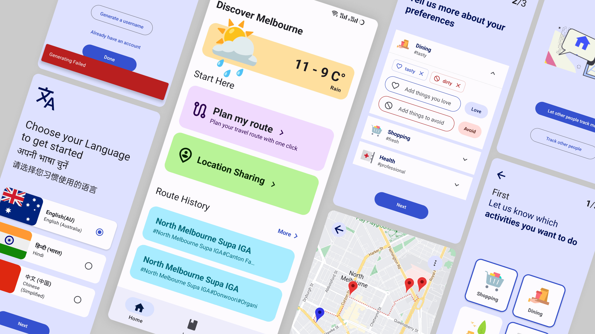

---
title: >
  Settle-Aid: Maintenance Documentation
subtitle: TP01 - Top Mello 
author:
  - Can Wang
  - Gordon Leung
  - Jiashi Chen
  - Jincheng Song
  - Jirathip Kunkanjanathorn
date: 2023-10-05
---
\thispagestyle{empty}


\newpage

\thispagestyle{empty}
\tableofcontents
\newpage
\pagenumbering{arabic}

# Introduction

This guide provides an in-depth look into the backend and frontend technologies that underpin our system. Each technology, from PostgreSQL to Socket.io on the backend and from React Native to Axios on the frontend, has been selected to optimize performance, security, and user experience. This documentation is intended to offer clarity on our system's architecture and design choices, serving as a valuable reference for developers and other stakeholders involved in maintaining and enhancing the platform.


# Backend


Welcome to the backend architecture documentation. This resource provides detailed information about the tools, technologies, and decisions that power the platform. The primary objective is to deliver a seamless user experience, ensuring accuracy, speed, and scalability. The choices made in the technology stack reflect this commitment.

## Repository
- [Backend Github Repository](https://github.com/topmello/settle-aid-backend)
- Zip file of the repository: [Backend Zip File](...)

## Purpose

Understanding the underlying philosophy of the system is essential. The backend has been built with a user-centric approach. The technology stack is chosen to facilitate rapid iterations, robust data storage, real-time interactions, and insightful analytics. This design allows for continual improvement, ensuring that user expectations are met and exceeded.

## Key Features

- Scalability: The stack is designed to handle growth. Whether it's increasing user data or extending the feature set, the architecture is prepared.
- Performance: Through tools like Redis and FastAPI, a fast and responsive experience is ensured.
- Security: Protecting user data and maintaining privacy is paramount. Every tool and process is vetted to uphold this.
- Maintainability: With tools like Docker and PyTest, it's ensured that the codebase remains organized and that any updates or changes are efficiently integrated and tested.

## Technology Stack

- [PostgreSQL](https://www.postgresql.org): Serving as our primary relational database, PostgreSQL stores user-specific data, including generated routes, prompts used, and room-related information. Its robustness and scalability ensure the efficient handling of user interactions and data.
- [SQLALchemy](https://www.sqlalchemy.org): A Python-based ORM, SQLAlchemy facilitates the interaction between the backend and the database. It also enables the use of Pythonic syntax, allowing for more intuitive and readable code.
- [Alembic](https://alembic.sqlalchemy.org/en/latest/): Alembic is a lightweight database migration tool that enables the creation of database schemas and the migration of data. It is used to create and update the database schema, ensuring that the database is always up-to-date with the latest changes.
- [Redis](https://redis.io): Integrated for its superior performance in managing data with short lifespans, Redis excels in real-time data retrieval. Its capabilities extend to session management, location tracking, and log streaming, all while ensuring optimal storage and enhanced security through its TTL feature.
- [FastAPI](https://fastapi.tiangolo.com): Adopted for its performance and Pythonic nature, FastAPI aids in creating a seamless user interface. It employs Pydantic for data validation, ensuring the quality and integrity of user data inputs.
- [Pydantic](https://docs.pydantic.dev/latest/): Pydantic is a Python library that facilitates data validation and parsing. It is used to validate user inputs, ensuring that the data is of the correct type and format.
- [SlowAPI](https://github.com/laurentS/slowapi): A rate limiting library for Starlette and FastAPI. It is used to limit the number of requests per second to the backend, preventing overloading and ensuring optimal performance.
- Open Data Melbourne: Leveraging datasets from Melbourne's open data platform, our platform gains access to a wealth of city-specific information, ranging from infrastructure to cultural landmarks. This data integration enhances the platform's accuracy and relevance when offering route suggestions or city insights to users.
- [Python SocketIO Server](https://python-socketio.readthedocs.io/en/latest/): Facilitating real-time communication, especially for location tracking features, SocketIO ensures instantaneous data transmission, offering users a real-time interactive experience.
- MapBox, Google Translate & Google Location APIs: These external APIs are integrated to enrich the platform's functionalities. MapBox assists in generating routes, Google Translate aids in user input translation, and the Google API is pivotal for location search, all culminating in a comprehensive user experience.
- [Huggingface's Sentence Transformers](https://huggingface.co/sentence-transformers/all-MiniLM-L6-v2): This AI-powered integration enhances the platform's semantic search capabilities, allowing for deeper comprehension of user inputs and more contextually relevant responses.
- [PyTorch](https://pytorch.org): PyTorch is a Python-based machine learning library that enables the use of deep learning models. It is used to train and deploy the name generator model.
- [PyTest](https://pytest.org): PyTest is a Python testing framework that enables the creation of unit tests. It is used to ensure the quality and integrity of the codebase, especially when new features are added.
- [Docker](https://www.docker.com): Docker containers are used to encapsulate the development environment, ensuring that all developers work within the same context. This also enables developers to access and observe real-time code modifications.

## Database

The database system combines the strength of PostgreSQL with Redis's rapid in-memory processing.

The **Entity Relationship Diagram (ERD)** visually details the interconnectedness of the database tables.




- **PostgreSQL** serves as the primary database, adept at managing vector-based and geo-spatial queries. For consistent deployment, a Dockerised `ankane/pgvector` image is used alongside the `postgresql-15-postgis-3` geo-spatial extension. The system incorporates **pgvector** for vector operations and **PostGIS** for spatial data insights. Tables are structured using SQLAlchemy and Alembic, the latter ensuring smooth data migrations.

- **Redis**, the secondary in-memory database, focuses on caching and TTL-based data management, speeding up data retrieval and reducing reliance on the primary database. It assists in handling refresh tokens, room PINs, and logs. A layered data-fetching approach prioritizes Redis for speed, falling back on PostgreSQL when necessary.


Together, PostgreSQL and Redis create a reliable and efficient data management backbone, facilitating various functionalities and ensuring smooth operations.

### PostgreSQL

#### Implementation Details

The core database is designed using PostgreSQL, chosen particularly for its prowess in handling vector-based and geo-spatial queries. These functionalities are essential for many modern applications that rely on location data and vector operations. To streamline the setup process and ensure consistency across different environments, a Dockerised approach has been adopted. The ankane/pgvector Docker image is leveraged, given its preinstalled pgvector extension. Additionally, to enhance the geo-spatial querying capabilities, the postgresql-15-postgis-3 extension is integrated. This combination provides a solid foundation for building scalable and efficient data-driven applications, allowing for intricate data operations, ranging from location-based services to advanced vector computations.


#### Extensions

- Vector Extension (pgvector): pgvector provides efficient vector operations within PostgreSQL. It facilitates operations like similarity searches and nearest neighbor searches. Its integration ensures that vector-based computations are not only feasible but also optimized for peak performance.
- Geo-Spatial Extension (PostGIS): PostGIS enhances PostgreSQL, transforming it into a database that understands location and spatial relationships. It's essential for applications needing spatial databases.


#### Tables
The primary database is structured using SQLAlchemy, With the integration of specialized modules like geoalchemy2 and pgvector, the database harnesses advanced capabilities, ensuring spatial data management and embedding functionalities are efficient and robust. This section offers a brief description of each table, describing its purpose, structure, and relationship within the database.


- **User**: Captures the essential user information, including unique identifiers, usernames, passwords, and account creation timestamps.

- **RefreshToken**: Stores refresh tokens for users, facilitating secure session management and associated expiration times.

- **Prompt**: Contains data about prompts created by users, encompassing arrays of prompts, negative prompts, location types, and creation timestamps.

- **Route**: Holds the details of routes, including arrays of locations, latitudes, longitudes, instructions, durations, and associated user creators.

- **User_Route_Vote**: A junction table that registers user votes for different routes, ensuring user engagement is tracked.

- **Prompt_Route**: Links prompts with routes, reinforcing the connection between user-generated content and available routes.

- **Landmark, Restaurant, Grocery, and Pharmacy**: These tables store respective location details, including names and geographical coordinates. Furthermore, they have an 'embedding' column which facilitates location recommendation.

- **Prompt_Landmark, Prompt_Restaurant, Prompt_Grocery, and Prompt_Pharmacy**: These tables bridge the association between prompts and various location types, ensuring each user-generated prompt can be linked to specific landmarks, restaurants, groceries, or pharmacies.

- **Challenge**: Centralizes information about challenges, encapsulating their names, types, grades, scores, and associated user challenges.

- **User_Challenge**: Manages user interactions with challenges, detailing the user, challenge identifiers, the year, month, day of interaction, progress made, and if the score was added.

### Redis


Redis, a highly performant in-memory data structure store, serves as a secondary database within our platform. Its primary role is for caching data, offering rapid data retrieval compared to traditional databases. Due to its in-memory nature, Redis ensures ultra-fast data access, making it an ideal choice for caching scenarios where speed is paramount.

#### Functionality

The application utilises Redis mainly for data management with Time-To-Live (TTL). TTL ensures that cached data has an expiration time, optimising cache performance and data relevance. By automatically invalidating stale or outdated data, the system can maintain fresh data in the cache, ensuring users receive the most up-to-date information while reducing unnecessary database queries.

#### Implementation Details

- **Refresh Token Management**: Redis efficiently handles refresh tokens for users. These tokens are crucial for maintaining user sessions, and having them in Redis allows for swift access and validation. 

- **Room Data**: Redis aids in generating unique room PINs, ensuring these are stored promptly and can be quickly fetched or validated.

- **Feed & Logs**: Activities such as user actions or system logs are also cached in Redis. This offers an efficient way to monitor and log user activities, and system events, in real-time.

- **Data Fetching Strategy**: The platform employs a strategy where it first attempts to fetch data from Redis. If the data is unavailable (due to cache misses or TTL expiry), it resorts to the primary PostgreSQL database. Once fetched, the data is then stored in Redis for subsequent swift access. This layered approach ensures that the system capitalizes on the speed of Redis while maintaining the reliability of PostgreSQL.

#### Enhancements & Best Practices

Using decorators like `@async_retry()`, the platform ensures resilience in its Redis operations, retrying operations that might initially fail due to transient issues. Async context managers, such as `redis_room_db_context()`, ensure that Redis connections are efficiently managed, opened when needed, and closed after operations conclude, optimizing resource usage.


## Endpoints

### User endpoint

#### **Generate Username**

- **URL**: `/user/generate/`
- **Method**: `GET`
- **Description**: 
  This endpoint automatically creates a unique username. It utilizes a Transformer decoding architecture to generate the username and ensures its uniqueness by verifying against existing names in the database.
  
- **Response**: 
  The response will include a `username` string, representing the newly generated username.

#### **Retrieve User by ID**

- **URL**: `/user/{user_id}/`
- **Method**: `GET`
- **URL Parameters**: 
  - `user_id`: The ID of the user to retrieve.
- **Description**: 
  This endpoint fetches a specific user based on their `user_id`. It also returns the latest prompts associated with that user. For security reasons, users can only fetch their own details.
  
- **Response**: 
  The response will return the user's details, such as `user_id`, `username`, `created_at`, and an array of their most recent `prompts`.

#### **Create User**

- **URL**: `/user/`
- **Method**: `POST`
- **Description**: 
  This endpoint allows the creation of a new user. It ensures that the username is unique and hashes the password before storing it in the database.
  
- **Body Parameters**: 
  - `user`: The user details to be created. It includes fields like `username` and `password`.
  
- **Response**: 
  The response will return the created user's details, including `user_id`, `username`, and `created_a


### Authentication


#### **Authenticate User (v1)**

- **URL**: `/login/`
- **Method**: `POST`
- **Body Parameters**: 
  - `user_credentials`: A JSON object with the user's `username` and `password`.
- **Description**: 
  This endpoint attempts to authenticate a user using the provided credentials. If successful, it returns a JWT access token.
  
- **Response**: 
  A JSON object containing an `access_token` and its `token_type` which is "bearer".

#### **Authenticate User (v2)**

- **URL**: `/login/v2/`
- **Method**: `POST`
- **Body Parameters**: 
  - `user_credentials`: A JSON object with the user's `username` and `password`.
- **Description**: 
  This enhanced version of the login endpoint offers additional features over its predecessor. When a user is authenticated, it returns a JWT access token, as well as a refresh token to enable future token renewals without requiring re-authentication. The endpoint also handles cases where the login request originates from a web UI, setting the JWT as a cookie.
  
- **Response**: 
  A JSON object containing the user's `user_id`, `username`, the `access_token` and its `token_type` which is "bearer", as well as the `refresh_token` and their respective expiration times.

#### **Refresh Access Token**

- **URL**: `/login/v2/refresh/`
- **Method**: `POST`
- **Body Parameters**: 
  - `refresh_token`: A JSON object with the refresh token used to generate a new access token.
- **Description**: 
  This endpoint allows a user to refresh their JWT access token using a valid refresh token. By using the refresh mechanism, users can obtain a new access token without undergoing a full re-authentication process.
  
- **Response**: 
  A JSON object containing the user's `user_id`, `username`, a new `access_token` and its `token_type` which is "bearer", as well as the existing `refresh_token` and their respective expiration times.


### Search Endpoint

#### **Search for a Route Based on User Queries**

- **URL**: `/search/route/`
- **Method**: `POST`
- **Body Parameters**: 
  - `querys`: A JSON object containing the user's desired `location_type`, `latitude`, `longitude`, `distance_threshold`, `similarity_threshold`, and desired `route_type`.
- **Description**: 
  This endpoint allows users to search for a route based on specific queries and their current location. The returned route is calculated by matching the user's query against available locations within a specified distance threshold and similarity score. Furthermore, this route is saved as a prompt linked to the user's account.
  
- **Response**: 
  A JSON object representing the found route. This includes the list of locations, their coordinates, the route's path, instructions for the route, and the route's total duration.

#### **Enhanced Route Search with Negative Queries**

- **URL**: `/search/v2/route/`
- **Method**: `POST`
- **Body Parameters**: 
  - `querys`: An enhanced JSON object that, in addition to the parameters in the previous endpoint, allows users to provide negative queries to exclude certain results.
- **Description**: 
  This enhanced version of the search route allows users to provide additional negative queries, ensuring that certain types of locations are excluded from the resulting route. If a location matches a negative query with a similarity score higher than a specified threshold, it is excluded from the search results. This endpoint is particularly useful for users who want more control over the types of places included in their routes.
  
- **Response**: 
  A JSON object representing the found route, similar to the previous endpoint but with the addition of a route ID. This ID can be used to reference the route in other parts of the system.
This module provides endpoints related to searching for locations based on user queries. It supports both single and sequence-based search queries.


### Route Endpoint


#### **Get Route Details**

- **URL**: `/routes/{route_id}/`
- **Method**: `GET`
- **URL Parameters**: 
  - `route_id`: The ID of the desired route.
- **Description**: 
  This endpoint retrieves detailed information about a specific route identified by the `route_id`. The returned data includes route ID, locations, coordinates, instructions, duration, creation time, and the number of votes for the route.

- **Response**: 
  The response will include a `route` object and a `num_votes` integer. The `route` object further contains `route_id`, `locations` (array of strings), `locations_coordinates` (array of objects with `latitude` and `longitude`), `route` (array of objects with `latitude` and `longitude`), `instructions` (array of strings), `duration` (floating-point number), and `created_at` (date-time in ISO 8601 format).

#### **Delete Route**

- **URL**: `/routes/{route_id}/`
- **Method**: `DELETE`
- **URL Parameters**: 
  - `route_id`: The ID of the route to delete.
- **Description**: 
  This endpoint allows for the deletion of a route specified by the `route_id`. The request must be made by the authenticated user who owns the route.
  
- **Response**: 
  Upon successful deletion, the server will return a `204 No Content` HTTP status code with no response body. If the route does not exist or the user is not authorized, appropriate error codes and messages will be returned.


#### **Get Routes by User ID**

- **URL**: `/user/{user_id}/`
- **Method**: `GET`
- **URL Parameters**: 
  - `user_id`: The ID of the user whose routes are to be retrieved.
- **Description**: 
  Retrieves a list of routes created by a specified user. The endpoint includes pagination support with offset and limit parameters, and is rate-limited to 5 requests per second.
- **Query Parameters**:
  - `offset`: Starting point for pagination, default is 0.
  - `limit`: Maximum number of routes to retrieve, default is 10.
- **Response**: 
  A list of routes and their respective vote counts.
  
#### **Get Favorite Routes by User ID**

- **URL**: `/user/fav/{user_id}/`
- **Method**: `GET`
- **URL Parameters**: 
  - `user_id`: The ID of the user whose favorite routes are to be retrieved.
- **Description**: 
  Retrieves a list of favorite routes created by a specified user. Similar to the above endpoint, this also includes pagination and rate-limiting.
- **Query Parameters**:
  - `offset`: Starting point for pagination, default is 0.
  - `limit`: Maximum number of favorite routes to retrieve, default is 10.
- **Response**: 
  A list of favorite routes and their respective vote counts.
  
#### **Get Routes Favorited by User ID**

- **URL**: `/feed/user/fav/{user_id}/`
- **Method**: `GET`
- **URL Parameters**: 
  - `user_id`: The ID of the user whose favorited routes are to be retrieved.
- **Description**: 
  Retrieves a list of routes favorited by a specified user. This also includes pagination and rate-limiting functionality.
- **Query Parameters**:
  - `offset`: Starting point for pagination, default is 0.
  - `limit`: Maximum number of routes to retrieve, default is 10.
- **Response**: 
  A list of routes and their respective vote counts.
  
#### **Publish a Route**

- **URL**: `/publish/{route_id}/`
- **Method**: `POST`
- **URL Parameters**: 
  - `route_id`: The ID of the route to be published.
- **Description**: 
  This endpoint allows users to publish their route to the public feed after checking the existence of the route and the authorization of the user.
- **Response**: 
  A dictionary containing details about the publishing status.
  
#### **Get Top Routes**

- **URL**: `/feed/top_routes/`
- **Method**: `GET`
- **Description**: 
  Returns the top routes based on the provided criteria and order, either by creation date or votes. It first fetches the route IDs from Redis and then queries the database for more details.
- **Query Parameters**:
  - `order_by`: The ordering criterion, can be either 'created_at' or 'num_votes'. Defaults to 'num_votes'.
  - `offset`: Starting point for pagination, default is 0.
  - `limit`: Maximum number of routes to return, default is 10.
- **Response**: 
  A list of top routes with their associated vote details.

Each of these endpoints is designed to work with the user and route data, allowing retrieval and publication of routes based on various parameters and criteria. Proper authorization, rate limiting, and pagination have been applied where necessary to ensure the security and efficiency of the API.


### Challenges Endpoint


#### Fetch Leaderboard

- **URL**: `/leaderboard/`
- **Method**: `GET`
- **URL Parameters**: 
    - `limit`: integer, optional (default is 10)
- **Description**: This endpoint returns the top N users based on their weekly scores. `limit` specifies the number of top users to fetch.
- **Response**: 
    - **LeaderboardOut**
        - `username` (string): The username of the user.
        - `score` (float): The overall score of the user.
    - Example: 
    ```json
    [
        {"username": "user1", "score": 320.5},
        {"username": "user2", "score": 280.2}
    ]
    ```

#### Fetch User Challenge

- **URL**: `/{user_id}/`
- **Method**: `GET`
- **URL Parameters**: 
    - `user_id`: integer, required
- **Description**: This endpoint returns the challenges created today for the given `user_id`.
- **Response**: 
    - list of **UserChallengeOut**
        - `challenge` (Challenge): The challenge details.
            - `name` (string): The name of the challenge.
            - `type` (string): The type of the challenge.
        - `year` (integer): The year of the challenge.
        - `month` (integer): The month of the challenge.
        - `day` (integer): The day of the challenge.
        - `progress` (float): The progress of the challenge.
    - Example: 
    ```json
    [{
        "challenge": {"name": "Walk 5000 Steps", "type": "distance_travelled"},
        "year": 2023,
        "month": 9,
        "day": 30,
        "progress": 0.8
    }]

#### Fetch All Challenges for User

- **URL**: `/all/{user_id}/`
- **Method**: `GET`
- **URL Parameters**: 
    - `user_id`: integer, required
- **Description**: This endpoint returns all the challenges for the given `user_id`.
- **Response**: Returns a list of **UserChallengeOut** as described abov

#### Calculate Weekly Score

- **URL**: `/weekly_score/{user_id}/`
- **Method**: `GET`
- **URL Parameters**: 
    - `user_id`: integer, required
- **Description**: This endpoint calculates and returns the weekly scores for the given `user_id`.
- **Response**: 
    - list of **ChallengeScoreOut**
        - `date` (datetime): The date of the score.
        - `score` (float): The overall score.
        - `distance_travelled_score` (float, optional): The score from distance travelled challenges.
        - `route_generation_score` (float, optional): The score from route generation challenges.
        - `favourite_sharing_score` (float, optional): The score from favourite sharing challenges.
    - Example: 
    ```json
    [{
        "date": "2023-09-30T12:00:00",
        "score": 100.5,
        "distance_travelled_score": 50.2,
        "route_generation_score": 25.1,
        "favourite_sharing_score": 25.2
    }]
    ```


#### Add Challenge Distance Travelled

- **URL**: `/distance_travelled/{user_id}/`
- **Method**: `POST`
- **URL Parameters**: 
    - `user_id`: integer, required
- **Description**: This endpoint adds a distance travelled challenge for a user.
- **Request Body**: 
    - **DistanceTravelledChallenge**
        - `steps` (integer,  steps between 0 - 50000): The number of steps travelled.
    - Example: 
    ```json
    {
        "steps": 45000
    }
    ```
- **Response**: Returns a dictionary with details about the operation.

#### Add Challenge Route Generation

- **URL**: `/route_generation/{user_id}/`
- **Method**: `POST`
- **URL Parameters**: 
    - `user_id`: integer, required
- **Description**: This endpoint adds a route generation challenge for a user.
- **Request Body**: 
    - **RouteGenerationChallenge**
        - `routes_generated` (integer): The number of routes generated.
    - Example: 
    ```json
    {
        "routes_generated": 5
    }
    ```
- **Response**: Returns a dictionary with details about the operation.

#### Add Challenge Favourite Sharing

- **URL**: `/favourite_sharing/{user_id}/`
- **Method**: `POST`
- **URL Parameters**: 
    - `user_id`: integer, required
- **Description**: This endpoint adds a favourite sharing challenge for a user.
- **Request Body**: 
    - **RouteFavChallenge**
        - `routes_favourited_shared` (integer): The number of routes favourited/shared.
    - Example: 
    ```json
    {
        "routes_favourited_shared": 3
    }
    ```
- **Response**: Returns a dictionary with details about the operation.

### Translation Endpoint


#### Utility Functions

- translate_text(text: str) -> dict: Translates a single text into the target language and returns the translated text.
- translate_list(text_list: list[str]) -> list[str]: Translates a list of texts into the target language and returns a list of translated texts.

#### Configuration

- The Google Cloud Translation API requires authentication. The path to the authentication credentials is specified in the credential_path variable. Ensure that the google_application_credentials.json file is present in the specified path and contains valid credentials.
- The environment variable GOOGLE_APPLICATION_CREDENTIALS is set to the path of the authentication credentials to authenticate the API requests.


#### **Translate Texts**

- **URL**: `/translate/`
- **Method**: `POST`
- **Description**: 
  This endpoint allows users to translate a list of texts. Users provide a list of texts, and the service returns the translated versions of those texts.
- **Request Body**:
  - `texts` (list of strings): The list of texts that need to be translated, as specified in the `schemas.TranslateQuery` model.

- **Response**: 
  The response will be a JSON object containing the translated texts. The structure of the response is given by the `schemas.TranslateRes` model, which primarily consists of the `results` attribute. The `results` attribute holds the list of translated texts corresponding to the input texts provided.


### Tracker Endpoint

This module allow user to create room in sockerIO and let other user join.

#### REST API

##### **Generate Room PIN**

- **URL**: `/track/generate-pin/`
- **Method**: `GET`
- **Description**: 
  This endpoint is designed to generate a unique 6-digit room PIN that is used to identify tracking rooms. Once generated, this PIN is stored in a Redis database with a default expiration time of 30 minutes. Users need to be logged in to generate a room PIN.

- **Response**: 
  A JSON object containing the generated room PIN. The structure of the response is represented by the `schemas.TrackRoomOut` model, which primarily consists of the `room_id` attribute, indicating the generated PIN.

#### SocketIO Events

##### Connect

- Description: Activated when a client attempts to connect.
- Requirements: A JWT token is mandatory to establish a connection.
- Failure: If the JWT token is missing or invalid, the client will be automatically disconnected.
- API_URL=https://api.settle-aid.tech
- SOCKET_PATH=/track-sio/sio/
- Examples:

```
newSocket = io(process.env.REACT_APP_API_URL, {
      path: process.env.REACT_APP_SOCKET_PATH,
      transportOptions: {
        polling: {
          extraHeaders: {
            'Authorization':`Bearer ${token}`
  }
  }
  }
  })
```

##### Disconnect

- Description: Activated when a client disconnects. The event logs the disconnection details.

##### Join Room

- Description: Activated when a client wishes to join a room. The client should emit a message to the `join_room` event with the roomId included in the message.
- Validation: The system will verify if the room exists or if it has expired.
- Expiration: Rooms have a lifespan of 30 minutes.

##### Leave Room

- Description: Activated when a client decides to leave a room. The client should emit a message to the `leave_room` event with the roomId included in the message.

##### Move

- Description: Activated when a message is sent to the `move` event.
- Message Format: The message should adhere to the following structure: { lat: float, long: float, roomId: string }.
- Failure: If the message format is incorrect, an error message will be emitted to the `error` message type.

## Data Validation

FastAPI leverages the power of Pydantic for data validation, serialisation, and documentation. Pydantic ensures that the data conforms to expected formats and helps in error handling. Below is a brief description of each schema:

- **UserCreate**: Defines the structure for user creation with constraints on username and password length and pattern.
  
- **LoginRequest**: Represents user login request, with validation on username and password.
  
- **User**: Describes a user with attributes like user_id, username, password, and creation date.
  
- **Prompt & PromptV2**: Outlines prompts created by users with attributes like prompt id, user id, prompts, and creation date. Version 2 (`PromptV2`) also includes negative prompts.
  
- **RouteOut & RouteOutV2**: Defines route data. Version 2 (`RouteOutV2`) includes additional attributes like route id and creation date. It also converts latitudes and longitudes into dictionary format.
  
- **RouteVoteOut & RouteVoteOutUser**: Outlines user votes for routes. The latter also indicates if a user has voted.
  
- **UserOut**: Describes a user along with their associated prompts.
  
- **Token & TokenV2**: Represents token data, with the latter (`TokenV2`) offering a comprehensive view, including user id, access, and refresh token details.
  
- **Query, QuerySeq, RouteQuery, & RouteQueryV2**: Defines search parameters for location-based queries. They include validation for location type and route type.
  
- **SearchResult**: Represents search results, providing the name, coordinates, and similarity of the result.
  
- **UsernameGen & TranslateQuery**: Outlines structures for generating usernames and translating queries, respectively.
  
- **VoteIn**: Represents the structure for user votes on routes.
  
- **Challenge & UserChallengeOut**: Defines challenges and user interactions with challenges.
  
- **LeaderboardOut**: Represents user scores on a leaderboard.

The schemas incorporate constraints like `constr()` and `conint()`, ensuring data like username and password adhere to specific formats or value ranges. Validators like `field_validator` and `root_validator` ensure custom validations on fields, enhancing the robustness of data input.

In essence, Pydantic, combined with FastAPI, offers a systematic and efficient approach to manage and validate incoming and outgoing data, ensuring data integrity and minimizing potential errors.

## System Messages


### HTTP Exceptions


| Exception Type               | Type                      |
| ---------------------------- | ------------------------- |
| CustomHTTPException          | `default_type`            |
| InvalidCredentialsException  | `invalid_credentials`     |
| UserNotFoundException        | `user_not_found`          |
| UserAlreadyExistsException   | `user_already_exists`     |
| InvalidRefreshTokenException | `invalid_refresh_token`   |
| NotAuthorisedException       | `not_authorised`          |
| LocationNotFoundException    | `no_location`             |
| InvalidSearchQueryException  | `invalid_search_query`    |
| RouteNotFoundException       | `no_route`                |
| ParametersTooLargeException  | `parameters_too_large`    |
| AlreadyVotedException        | `already_voted`           |
| VoteNotFoundException        | `vote_not_found`          |
| RequestValidationError       | `missing`                 |
| RequestValidationError       | `string_pattern_mismatch` |
| RequestValidationError       | `json_invalid`            |
| RequestValidationError       | `string_type`             |
| RequestValidationError       | `string_too_short`        |
| RequestValidationError       | `string_too_long`         |
| RequestValidationError       | `value_error`             |
| RequestValidationError       | `value_error`             |

For more details, please refer to [HTTP Exceptions](https://topmello.github.io/docs/backend/system_message)

### SocketIO messages

| Event        | Message Type | Details Type                | Details Msg                                              |
| ------------ | ------------ | --------------------------- | -------------------------------------------------------- |
| `connect`    | `error`      | `invalid_credentials`       | 'Invalid credentials'                                    |
|              | N/A          | Varies with `HTTPException` | Depends on the error detail from exception               |
| `join_room`  | `error`      | `no_room`                   | 'Room not found or has expired'                          |
|              | `room`       | `joined_room`               | E.g. "admin has joined room 448408"                      |
| `leave_room` | `room`       | `lefted_room`               | E.g. "admin has left room 448408"                        |
| `move`       | `move`       | `success`                   | Object with `lat` and `long`, e.g. `{lat: 34, long: 34}` |
|              | `error`      | `invalid_data`              | 'Invalid data'                                           |
| `disconnect` | `room`       | `disconnected`              | E.g. "admin disconnected"                                |


## Unit Test

### Setup

- **test_client**: This fixture sets up a test client for the FastAPI application. It also handles database migrations and inserts test data.

### Tests

1. **test_access_docs**: 
    - Tests if accessing the root endpoint returns a 401 Unauthorized status.
    - Checks if the response contains the 'WWW-Authenticate' header.

2. **test_generate_name**: 
    - Tests the endpoint responsible for generating a name.
    - Asserts a 200 OK status.

3. **test_translate**: 
    - Tests the translation endpoint.
    - Sends a Chinese greeting and expects the translation to be "Hello".

4. **test_create_user**: 
    - Tests user creation.
    - Checks for either a successful creation or an error indicating the username is already registered.

5. **test_login** and **test_login_v2**: 
    - Tests user login functionality.
    - Checks for a successful login and the presence of an access token in the response.
    - The V2 version also tests the refresh token functionality.

6. **test_route** and **test_route_v2**: 
    - Tests route generation based on search criteria.
    - Checks for successful route generation and the expected number of locations in the route.
    - The V2 version includes additional tests for route retrieval and deletion.

7. **test_vote**: 
    - Tests the voting functionality for a route.
    - Checks for successful vote creation, vote conflict, and vote deletion.

8. **test_challenge**: 
    - Tests the challenge functionality.
    - Checks for successful challenge creation based on different criteria (distance traveled, routes generated, favorite routes shared).
    - Retrieves all challenges for the user and filters out the challenges for the current day.
    - For each of today's challenges, it checks if the progress is between 0 and 1.
    - It also checks specific challenges to ensure the progress matches the expected values.


# Frontend
In the realm of frontend development, a performant and responsive user interface is paramount. Why? The frontend serves as the primary interaction point for users and often shapes the entirety of their experience.  
With React Native at the core of our tech stack, developers can harness the power of a cross-platform solution, ensuring consistent behavior and appearance across Android and iOS platforms.



## Key Features

**Cross-Platform Development**: With React Native, the app is developed once but can run on both Android and iOS. This makes for a cost-efficient development process, which our target audience values.

**Unified UI/UX**: React Native Paper ensures that the app maintains UI consistency across devices, resulting in a cohesive user experience.

**High-Performance API Calls**: Axios simplifies making API requests and handles them efficiently hence improve the user experience.

**Centralized State Management**: Redux offers a structured way to manage the app's global state, ensuring that components receive consistent data, which will be benifitial for collaboration between team members and future extension of the application functionailities.

**Persistent Data Storage**: With Redux Persist, the app's state data can survive app restarts, enhancing user experience.

**Multi-Language Support**: React i18next ensures that the app can be localized in various languages, which is critical for us to provide service to our target audience.

**Geolocation Services**: Expo Location and React Native Maps enable the app to offer map and location-based features. This adaption allows us to do realtime location sharing.

**Real-time Interaction**: Chat and updates in real-time which is built upon WebSocket protocol.

**Advanced Device Integration**: Direct calendar interaction, print capabilities and more.

## Technology Stack

Frontend Tech stack we use:

- [React Native](https://reactnative.dev/) - Fundamental Framework to build native app for Android and iOS in React
- [React Native Paper](https://reactnativepaper.com/) - UI component and theme library for UI consistency accross devices
- [React Native Dates](https://web-ridge.github.io/react-native-paper-dates/docs/intro) - Date selector component for React Native Paper
- [Expo Router](https://docs.expo.dev/routing/introduction/) - Routing between screens
- [Axios](https://axios-http.com/docs/intro) - API request library
- [Redux](https://redux.js.org/) - Global state management for React app
- [Redux Persist](https://github.com/rt2zz/redux-persist) - Data persistance for Redux
- [React i18next](https://react.i18next.com/) - Internalization for React
- [Expo Location](https://docs.expo.dev/versions/latest/sdk/location/) - Providing access to Geolocation
- [React Native Maps](https://www.npmjs.com/package/react-native-maps?activeTab=readme) - Cross-platform map component
- [Expo Calendar](https://docs.expo.dev/versions/latest/sdk/calendar/) - Provides an API for interacting with the device's system calendars
- [Expo KeepAwake](https://docs.expo.dev/versions/latest/sdk/keep-awake/) - A React component that prevents the screen from sleeping when rendered.
- [Expo Localization](https://docs.expo.dev/versions/latest/sdk/localization/) - A library that provides an interface for native user localization information.
- [Expo Print](https://docs.expo.dev/versions/latest/sdk/print/) - A library that provides printing functionality for Android and iOS (AirPrint).
- [React Native Share](https://reactnative.dev/docs/share) - Provide access to system share API
- [Socket.io Client](https://www.npmjs.com/package/socket.io-client) - For realtime messaging

## Global States
### AppState Documentation

Manage global application states such as theme, language, loading status, and notifications with the `AppState` Redux slice.

#### **State Structure**

The `AppState` has the following structure:

```
{
  isLoading: boolean,
  isFail: {
    message: string
  } | null,
  theme: "light" | "dark" | "system" | undefined,
  language: "en-AU" | "zh-CN" | "hi-IN" | undefined,
  privacyChecked: boolean,
  roomId: string | undefined
}
```

#### Usage

To use the `AppState` Redux slice, make sure to add it to your store's reducer.

##### State Selectors

These functions allow you to retrieve specific pieces of state:

- `selectIsLoading`: Returns the `isLoading` state.
- `selectIsFail`: Returns the `isFail` state.
- `selectTheme`: Returns the `theme` state.
- `selectLanguage`: Returns the `language` state.
- `selectPrivacyChecked`: Returns the `privacyChecked` state.
- `selectRoomId`: Returns the `roomId` state.

##### Actions

- `loading`: Set the `isLoading` state to true.
- `loaded`: Set the `isLoading` state to false.
- `fail`: Set the `isLoading` state to false and update the `isFail` message.
- `setDarkTheme`, `setLightTheme`, and `setSystemTheme`: Update the `theme` state.
- `setLanguage`: Set the language state to one of the available languages.
- `setPrivacyChecked` and `setPrivacyUnchecked`: Set the `privacyChecked` state.
- `setRoomId`: Update the `roomId` state.

### AuthState Documentation

Manage authentication states and user-specific details with the `AuthState` Redux slice.

#### **State Structure**

The `AuthState` has the following structure:

```
{
  id?: number,
  username?: string,
  token?: string,
  tokenExpiresAt?: string,
  refreshToken?: string,
  refreshTokenExpiresAt?: string,
  status: 'idle' | 'login' | 'loginSuccess' | 'loginFail' | 'logout' | 'registering' | 'registerSuccess' | 'registerFail' | 'refreshing' | 'refreshSuccess' | 'refreshFail' | 'logout'
}
```

#### **Actions**

##### Thunks

- `loginUser`: An asynchronous action to log in a user. Accepts an object with `username` and `password`.
- `refreshToken`: An asynchronous action to refresh the user's access token using the refresh token.
- `registerUser`: An asynchronous action to register a new user. Accepts an object with `username` and `password`.

##### Reducers

- `logoutUser`: Log out the user and reset their authentication data.

#### **Usage**

##### State Selectors

Utilize the following functions to retrieve specific pieces of the authentication state:

- `selectUserId`: Returns the user's ID.
- `selectUsername`: Returns the user's username.
- `selectToken`: Returns the user's access token.
- `selectAuthStatus`: Returns the current status of the authentication process.
- `selectTokenExpiresAt`: Returns the expiration time of the access token.
- `selectRefreshToken`: Returns the user's refresh token.
- `selectRefreshTokenExpiresAt`: Returns the expiration time of the refresh token.

### RouteState Documentation

The `RouteState` Redux slice manages user routing preferences and configurations.

#### **State Structure**

The `RouteState` has the following structure:

```
{
  location_type: LocationType[];
  query: string[];
  negative_query: string[];
  longitude: number;
  latitude: number;
  distance_threshold: number; // Distance between each location in meters
  similarity_threshold: number; // Range: 0-1
  negative_similarity_threshold: number; // Range: 0-1
  route_type: RouteType;
}
```

#### **Actions**

##### Reducers

- `setLocationType`: Set the location types.
- `setQueryWithLocationType`: Set the location type, query, and negative query. Both the location type and query arrays must be of the same length.
- `setLonLat`: Set the longitude and latitude for the route.
- `setDistanceThreshold`: Set the distance threshold for the route.
- `setSimilarityThreshold`: Set the similarity threshold for the route.
- `setRouteType`: Set the type of the route (e.g., walking, driving, etc.).

#### **Selectors**

Utilize the following functions to retrieve specific pieces of the routing state:

- `selectLocationType`: Returns the type of locations.
- `selectQuery`: Returns the query strings.
- `selectLonLat`: Returns the longitude and latitude.
- `selectDistanceThres`: Returns the distance threshold.
- `selectRouteState`: Returns the entire route state.

## Theming

### Accessing theme properties

Use the custom `useAppTheme()` hook to access to the theme variables. This hook extends React Native Paper hook and add custom colors like success and amber.
```js
import * as React from 'react';
import { useAppTheme } from "../../theme/theme";

export default function PaymentScreen() {
  const theme = useTheme();

  return <View style={{ backgroundColor: theme.colors.purpleContainer }} />;
}
``` 

### Accessing Dark mode
Using the custom `useAppTheme()` hook and use its dark boolean property
```js
import * as React from 'react';
import { useAppTheme } from "../../theme/theme";

export default function PaymentScreen() {
  const {dark} = useTheme();
  return <View style={{ fontWeight: dark? '800':'600' }} />;
}
```

### Change Theme Colors
Theme colors for both light and dark mode are configured in `theme\theme.ts` file, you can custom those colors by replacing the values or adding more color attributes.

Be sure to use hex rgb values for these colors.

## Custom Hooks

### `useFetch` Hook

Just as React provides hooks to embed state and other React features into your components, `useFetch` serves as a custom hook that provides an abstraction over the fetching mechanism, tailored to work efficiently within the React component lifecycle.

#### Overview

The `useFetch` hook is designed to interact with your API, handle various kinds of errors, and provide feedback to the user. It seamlessly integrates with your Redux store to maintain application state and utilizes other hooks for notifications, translations, and session management.

#### Usage

Here's a basic way to use the `useFetch` hook:

```jsx
const [data, fetchData] = useFetch(requestOptions);
```

#### Parameters

- **requestOptions (`RequestOptions`):** This is the main configuration for your fetch request. It includes all the details needed to make an API call.
- **deps (`any[]` = []):** Dependencies for the effect. The fetch operation will re-run whenever these dependencies change.
- **initialData (`T`):** You can provide an initial value for the data. Useful in scenarios where you have default or placeholder data.
- **shouldFetchImmediately (`boolean` = true):** A boolean indicating if the fetch should run immediately when the component mounts.
- **notificationMsg (`string`):** A message to display as a notification when the fetch is successful.

#### Returns

The hook returns an array with:

1. The fetched data (`T | null`)
2. A `fetchData` function to trigger the fetch manually.

#### Deep Dive

##### Session Validity

Before making the fetch, the hook checks the validity of the user session. If the session is invalid, it will dispatch a "Session Invalid" error to your Redux store.

##### Handling Errors

The hook comes with an integrated error-handling mechanism. If the fetch encounters an error, the hook identifies its type and dispatches appropriate actions or notifications. Some of the handled errors include:

- Network Error
- Unknown Error
- Invalid Credentials
- No Location
- Already Voted

It's designed to give feedback both to your Redux store and the user via notifications.

##### Notifications & Translations

The hook leverages the `useNotification` and `useTranslation` hooks to send user notifications and support internationalization respectively.

### Notification

The `NotificationContext.tsx` module is designed to provide an easy and consistent way to handle notifications in your React application using the react-native-paper library. It establishes a context for notifications, allows for notification messages with different severity levels, and provides the utility to dismiss or take action on a notification.  

`useNotification` custom hook provide a gateway to easy push notification to users. It returns an object containing the `pushNotification` method detailed below.


#### `Notification`

This is the structure of a notification:

- `message`: The core message of the notification.
- `type`: The severity type of the notification. It could be one of the following values:
  - `success`
  - `error`
  - `warning`
  - `info`
- `timeout`: The duration for which the notification will be displayed. Default is `4000` ms.
- `onDismiss`: A callback function that will be called when the notification is dismissed.
- `action`: An optional action that the user can take on the notification. It consists of:
  - `label`: The text that is displayed for the action.
  - `onPress`: A callback function that will be executed when the action is taken.

#### `NotificationContextType`

This defines the shape of the context:

- `notification`: The current active notification.
- `pushNotification`: A function to show a new notification.
- `clearNotification`: A function to clear the active notification.

#### `NotificationContext`

This is the main context that consumers will use to access the current notification and the functions to manipulate it. The context's default value is `undefined`.

#### `NotificationProvider`

This component wraps around your application or a part of it and provides the `NotificationContext` to its children.

The `NotificationProvider` maintains the current notification state, handles the logic for automatically dismissing a notification after its timeout, and renders the actual `Snackbar` component from the `react-native-paper` library to display the notification.

### Custom Hook: `useNotification`

The `useNotification` hook is a custom hook designed to provide easy access to the NotificationContext from any component within your React Native application.

```tsx
import { useContext } from "react";
import { NotificationContext } from "../store/NotificationContext";

export const useNotification = () => {
  const context = useContext(NotificationContext);
  if (!context) {
    throw new Error("useNotification must be used within a NotificationProvider");
  }
  return context;
};
```
By using the `useNotification` hook in your components, you can effortlessly interact with the notification system. It fetches the current notification context, ensuring that it's being accessed within the bounds of the `NotificationProvider`. If not, it throws a useful error to remind developers of the proper usage.

To leverage the capabilities of the notification system in any component:

```tsx
const { pushNotification } = useNotification();

// in an event handler or somewhere
pushNotification({
  message: 'This is a success message!',
  type: 'success'
});
```

## Routing

In the realm of mobile applications developed with Expo, routing plays a pivotal role in sculpting the user experience. Think of routing as the unseen conductor of an orchestra, seamlessly guiding users through different sections of an app, ensuring smooth transitions, efficient data passage, and intuitive backtracking. It's the backbone of navigation, shaping how users interact with the application's features and content. Without effective routing, even the most feature-rich applications can become unnavigable mazes, diminishing user engagement and satisfaction. Thus, for any application to be truly user-centric, a robust and efficient routing mechanism is indispensable.

### Route Graph

Please refer to the Prototype view of project's figma high fidelity design prototype

### Imperative Routing

#### Navigation with `router.push`
The `router.push` method is your go-to function for programmatically navigating to different screens or routes in your application.

```javascript
router.push(routeName, params);
```
* `routeName` (string): The name of the route/screen you wish to navigate to.
* `params` (object, optional): Any parameters or data you want to pass to the next route.

#### Navigate Back with `router.back`
Navigating back to the previous screen is as simple as it sounds. Use the `router.back` function to pop the current screen off the navigation stack and return to the screen you were on before.

```javascript
router.back();
```

# Conclusion

To conclude, this documentation outlines the cohesive architecture of our platform, detailing the backend's capabilities and the frontend's user interface features. The chosen technology stack ensures a balance between robust data handling, real-time interactions, and a consistent user experience across devices. As the platform evolves, this guide will remain an essential resource for developers, ensuring that the core principles and technologies are understood and easily referenced for future updates and maintenance.
