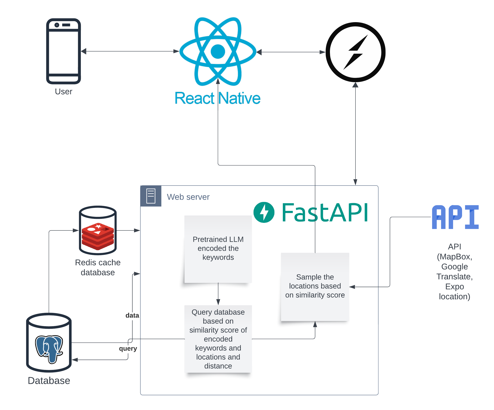

---
title: Support Documentation
author:
  - Can Wang
  - Gordon Leung
  - Jiashi Chen
  - Jincheng Song
  - Jirathip Kunkanjanathorn
---

\thispagestyle{empty}


\newpage

\thispagestyle{empty}
\tableofcontents
\newpage
\pagenumbering{arabic}

# Introduction

This support documentation offers a systematic guide for understanding the platform. The contents are divided into:

- **Documentation Page**: Outlines prerequisites, installation, local development, deployment, and details on communication between frontend and backend.
  
- **Data Workflows**: Focuses on the platform's data lifecycle, from collection to ingestion.
  
- **Backend**: Explores system operations, from running and testing to deployment and developer actions.
  
- **Frontend**: Describes system operation, shutdown, and deployment procedures.

**Technology Stack**

The frontend uses the **React Native** framework, complemented by tools like **React Native Paper** and a suite of libraries including **Redux** and **Socket.io Client**.

The backend uses the **FastAPI** web framework and employs **PostgreSQL** as the primary database, working with tools such as **SQLALchemy** for efficient data operations.

Integration with external APIs like **MapBox**, **Google Translate**, and **Google Location** enhances functionality. Semantic search capabilities are enhanced by **Huggingface’s Sentence Transformers**, with unit testing via **PyTest**.



\newpage
 
# Documentation Page

## Prerequisites
- Node.js and npm (Node Package Manager) should be installed on the local machine.
- A basic understanding of the project's structure and documentation requirements
- Access to the project repository and clone the Git repository using the command: 
  ```bash
  git clone https://github.com/topmello/topmello.github.io.git
  ```

- Or Downloading and extracting the ZIP file of the repository.

## Installation

Upon cloning or when updating dependencies, execute:

```bash
npm install
```

This command will ensure all necessary dependencies are installed.

## Local Development

Whether maintaining the documentation or familiarizing oneself as a new member, it's crucial to preview changes locally. Start the local development server with:

```bash
npm run start
```

This server will launch a browser window where most modifications will be reflected live without needing to restart the server.

## Deployment

Ensure membership in the organization. If not a member, fork the repository and proceed to deploy on the forked version.

Replace `<Your GitHub username>` with the respective GitHub username:

```bash
GIT_USER=<Your GitHub username> npm run deploy
```


# Data Workflows

## Prerequisites

- Python 3.8 or above and Pip should be installed on the local machine.
- Access to to the project repository and clone the Git repository using the command: 
  ```bash
  git clone https://github.com/topmello/settle-aid-data-wrangling.git

- Or downloading and extracting the ZIP file of the repository.

## Data Collection

In order to collect the open data, the following datasets are accessed from the [Melbourne Open Data Platform](https://data.melbourne.vic.gov.au/) using CSV format which require to download manually:

| Name                                                                                                                                                    | Frequency of Updates | License |
|---------------------------------------------------------------------------------------------------------------------------------------------------------|----------------------|------------|
| [Landmarks and places of interest](https://data.melbourne.vic.gov.au/explore/dataset/landmarks-and-places-of-interest-including-schools-theatres-health-services-spor/information/)                        | Monthly              | CC BY      |
| [Business establishments location and industry classification](https://data.melbourne.vic.gov.au/explore/dataset/business-establishments-with-address-and-industry-classification/information/) | Annually             | CC BY      |
| [Café, restaurant, bistro seats](https://data.melbourne.vic.gov.au/explore/dataset/cafes-and-restaurants-with-seating-capacity/information/)                          | Annually             | CC BY      |

## Data Processing

After the data is collected, the data should be store in the ./data folder in the project directory. Then, the data processing can be done by running each scipt related to the location type including restaurant, landmark, grocery, and pharmacy.

Noted that this step will take a long time to finish and it can be skipped to run backend server directly if the data is not updated and already processed.

## Data Ingestion

The processed data is stored in the ./data folder in the project directory as JSON file. The data is then ingested into the database by copying to JSON file to backend repository and running the ingestion script.

# Backend

## How to run the system

1. Clone the repository or from the zip file
2. Install Docker with Docker Compose
3. Run `docker-compose up -d` in the root directory (Compose V2 do not have - between docker-compose)
4. SSH into the backend container with `docker exec -it backend bash`
5. Migrate the database with `alembic upgrade head` inside the container (For the first time or when there's a change in the database schema)
6. Insert the data with `python -m scripts.insert_data` inside the container (For the first time or when there's a change in the dataset)

## How to shutdown the system

1. Run `docker-compose down` in the root directory

## How to test the system

### Unit test using pytest with Docker locally

1. Run `docker-compose -d` in the root directory
2. Run `docker exec -it backend pytest` to run the test

Noted that this test will remove all the data in the database where the test is run. The better way to test is to use CI/CD with Github Action.

### Unit test the system with Github Action

This workflow is triggered whenever there's a push to the main branch.

1. Checks out repository.
2. Builds and starts Docker Compose services using the dev configuration.
3. Runs pytest within backend service.
4. Shuts down and removes the containers afterward.

### Test the system with Postman

1. Ensure the system is up and running by following the provided steps under "How to run the system".
2. Launch the Postman application on your machine.
3. In the Postman interface, select the desired HTTP method (e.g., GET, POST, PUT, DELETE) from the dropdown.
4. Enter the system's endpoint URL you wish to test in the request URL field.
5. Depending on the endpoint:
    - Add necessary headers by clicking on the "Headers" tab and entering key-value pairs.
    - For methods like POST or PUT, click on the "Body" tab and input the required data in the appropriate format (e.g., JSON, form data).
    - If necessary, add query parameters by clicking on the "Params" tab and inputting key-value pairs.
6. Click the "Send" button to initiate the request to the backend.
7. Inspect the response received in the Postman response section below. Here, you can view status codes, response times, returned data, or any error messages.

## How to deploy the system


### Build and Push Images to Dockerhub with Github Action

Activated either manually or when there's a push to the deploy branch. The steps include:

1. Checking out repository.
2. Setting up QEMU & Docker Buildx.
3. Logging into Docker Hub using saved credentials.
4. Building Docker images from Dockerfiles (Dockerfile.db & Dockerfile.backend).
5. Pushing these images to Docker Hub.

### Setting up GCP Compute Instance

Before deploying on GCP, ensure the VM instance ready. To set up a VM instance:

1. Go to the GCP Console at https://console.cloud.google.com/.
2. Navigate to the Compute Engine and then VM Instances.
3. Click on "Create Instance."
4. Fill out the necessary details like Name, Region, Zone, Machine type, etc.
5. In the Boot Disk section, select an Ubuntu as OS.
6. Under the Firewall settings, make sure to allow HTTP and HTTPS traffic if your application needs to be accessed over the internet.
7. Once filled out, click "Create" to instantiate your VM.
8. SSH into the instance and install Docker and Docker Compose. The instructions can be found here: https://docs.docker.com/engine/install/ubuntu/
9. Install VIM using `sudo apt install vim`. (Optional)

### Deploying on GCP

1. SSH into GCP Instance: `gcloud compute ssh <instance-name> --zone <zone>`
2. Change directory: `cd ..` (Optional)
3. Make sure `docker-compose.yaml` and `<domain-name>` is exist in the directory. And, the domain DNS has been point to the backend virtual machine external IP address. For the first time configuration files for production are needed to be created as below. Noted that the keys and domain name needed to be changed according to the new production environment.
   
   - docker-compose.yaml
   ```yaml
   version: '3'
   services:
     db:
       container_name: settle-aid-db
       image: jirathipk/postgres-vec-geo:latest
       restart: always
       environment:
         - POSTGRES_DB=database
         - POSTGRES_USER=db_user
         - POSTGRES_PASSWORD=password1234
       volumes:
         - database_volume:/var/lib/postgresql/data/
         - dbbackups_volume:/backups
     redis:
       container_name: settle-aid-redis
       image: redis:latest
       restart: always
       command: redis-server --requirepass topmelloredis --loglevel verbose
       volumes:
         - redis_volume:/data
   
     backend:
       image: jirathipk/settle-aid-backend:latest
       container_name: settle-aid-backend
       user: myuser
       environment:
         - DATABASE_HOSTNAME=db
         - DATABASE_NAME=database
         - DATABASE_PORT=5432
         - DATABASE_PASSWORD=password1234
         - DATABASE_USERNAME=db_user
         - SECRET_KEY=SECRET_KEY 
         # Generate a new key with openssl rand -hex 32
         - REFRESH_SECRET_KEY=REFRESH_SECRET_KEY 
         # Generate a new key with openssl rand -hex 32
         - REFRESH_TOKEN_EXPIRE_DAYS=7
         - ALGORITHM=HS256
         - ACCESS_TOKEN_EXPIRE_MINUTES=30
         - MAPBOX_ACCESS_TOKEN=MAPBOX_ACCESS_TOKEN
         # Create an account and get the token from https://account.mapbox.com/
         - DOC_USERNAME=topmello
         - DOC_PASSWORD=da7da0df508738e37f18
         - REDIS_HOSTNAME=redis
         - REDIS_PORT=6379
         - REDIS_PASSWORD=topmelloredis
         - USER_CACHE_EXPIRY=3600
         - TRANSFORMERS_CACHE=/usr/src/app/transformers_cache
         - PYTEST_ADDOPTS="-o cache_dir=/usr/src/app/.pytest_cache"
         - VIRTUAL_HOST=staging.settle-aid.tech
         - VIRTUAL_PORT=8000
         - LETSENCRYPT_HOST=staging.settle-aid.tech
         - LETSENCRYPT_EMAIL=jirathip.ku@gmail.com
       depends_on:
         - db
         - redis
   
     pgbackups:
       container_name: settle-aid-db-backup
       image: prodrigestivill/postgres-backup-local
       restart: always
       user: postgres:postgres
       volumes:
         - dbbackups_volume:/backups
       links:
         - db
       depends_on:
         - db
       environment:
         - POSTGRES_HOST=db
         - POSTGRES_DB=database
         - POSTGRES_USER=db_user
     nginx-proxy:
       image: nginxproxy/nginx-proxy
       container_name: nginx-proxy
       ports:
         - "80:80"
         - "443:443"
       volumes:
         - /var/run/docker.sock:/tmp/docker.sock:ro
         - certs:/etc/nginx/certs
         - vhost:/etc/nginx/vhost.d
         - html:/usr/share/nginx/html
         - ./api.settle-aid.tech:/etc/nginx/vhost.d/api.settle-aid.tech # production domain name

     acme-companion:
       image: nginxproxy/acme-companion
       container_name: nginx-proxy-acme
       volumes:
         - /var/run/docker.sock:/var/run/docker.sock:ro
         - certs:/etc/nginx/certs
         - html:/usr/share/nginx/html
         - vhost:/etc/nginx/vhost.d
         - acme:/etc/acme.sh
       environment:
         - NGINX_PROXY_CONTAINER=nginx-proxy
       depends_on:
         - nginx-proxy

   volumes:
     certs:
     vhost:
     html:
     acme:
     database_volume:
     redis_volume:
     models_volume:
     dbbackups_volume:
   ```
   - domain name for NGINX proxy
   ```
   location /logs/stream/ {
       proxy_pass http://localhost:8000;
       proxy_set_header Host $host;
       proxy_set_header X-Real-IP $remote_addr;
       proxy_set_header X-Forwarded-For $proxy_add_x_forwarded_for;

       # SSE specific configurations
       proxy_http_version 1.1;
       proxy_set_header Connection '';
       proxy_buffering off;
       proxy_cache off;
       send_timeout 600s;
   }

   location /track-sio/sio/ {
       proxy_pass http://localhost:8000;
       proxy_set_header Host $host;
       proxy_set_header X-Real-IP $remote_addr;
       proxy_set_header X-Forwarded-For $proxy_add_x_forwarded_for;

       # WebSocket specific configurations
       proxy_http_version 1.1;
       proxy_set_header Upgrade $http_upgrade;
       proxy_set_header Connection "upgrade";

       # Disable buffering when the nginx proxy gets very busy (protects upstream service)
       proxy_buffering off;
       }

   ```
   
4. Pull the Latest Docker Compose Configuration: `sudo docker-compose pull`
5. Start the Containers: `sudo docker-compose -p settle-aid up -d`
  - The -p flag is to set a project name, which can be useful for running multiple environments on the same host
  - The -d flag is to run the containers in the background
6. For the first time, run the migration script: 
   ```bash
   sudo docker exec -it backend alembic upgrade head

   sudo docker exec -it backend python -m scripts.insert_data
   ```

### Actions for Developers:

- Modifications: If there are modifications or additions to packages, update requirements.txt so the Docker build process incorporates these changes.
- GitHub Workflows: The Python application test runs on pushes to the main branch, and the Dockerhub build and push are triggered either manually or when pushing to the deploy branch.

## How to add table to the database


1. While inside the backend container, navigate to the directory where your models are defined.
2. Create or modify an ORM model to define the structure of your new table.
3. Generate a new migration script using the command: 
   ```bash
   alembic revision -m "Add new_table_name table"
   ```
4. Edit the generated migration script in the `versions` directory, ensuring the `upgrade()` method contains logic to create your new table and the `downgrade()` method contains logic to remove it.
5. Apply the migration using 
   ```bash
   alembic upgrade head
   ```
6. Define ORM models in the `app/models.py` to interact with the new table accordingly.

Note: Please avoid running alembic revision on the production database. Instead, create the migration locally and apply it to the production database.


## How to backup and restore the database

### Setup Automated Backups

We use the docker-postgres-backup-local image to facilitate our backup tasks. Once the service is started, this will automatically create backups of database daily and maintain.

https://github.com/prodrigestivill/docker-postgres-backup-local

### Restore from fresh database

To restore a backup to a fresh database:

```bash
docker exec -it db psql \
--username=db_user \
--dbname=postgres -c "DROP DATABASE database;"
```

```bash
docker exec -it db psql \
--username=db_user \
--dbname=postgres -c "CREATE DATABASE database;"
```

```bash
docker exec -it db psql \
--username=db_user \
--dbname=database -c "CREATE EXTENSION IF NOT EXISTS postgis;"
```

```bash
docker exec -it db psql \
--username=db_user \
--dbname=database -c "CREATE EXTENSION IF NOT EXISTS vector;"
```

```bash
sudo docker exec \
-it db /bin/sh \
-c "zcat /backups/last/database-latest.sql.gz | \
psql --username=db_user --dbname=database -W"
```

#### Change permission for backups

If necessary, adjust the permissions for the backup files.

```bash
docker exec -u root -it db-backup chown -R 999:999 /backups
```

#### Check backup volumes content

To inspect the contents of the backup volume:

```bash
sudo docker run \
--rm -it \
-v settle-aid_dbbackups_volume:/volume_content alpine:latest /bin/sh
```


## How to launch new service in the backend


1. Pull the Desired Image: 
   If you haven't already, ensure that the desired service's Docker image is available on your system. If it's on a public registry like Docker Hub, you can pull it using:
   ```bash
   docker pull <image-name>:<tag>
   ```

   Replace `<image-name>:<tag>` with the name and the desired tag/version of the image.

2. Modify the Docker Compose File:
   Navigate to the directory containing your `docker-compose.yml` file and open it for editing.

3. Add the New Service:
   In the `docker-compose.yml` file, add a new service definition for the image you've just pulled. For instance:

   ```yaml
   services:
     ... 
     new-service-name:
       image: <image-name>:<tag>
       ports:
         - "<external-port>:<internal-port>"
       environment:
         - "ENV_VAR_NAME=value"
       volumes:
         - "/path/on/host:/path/in/container"
       depends_on:
         - "another-service-name"
   ```

   Replace placeholders as appropriate:
   - `<image-name>:<tag>` with the image's name and tag.
   - `<external-port>:<internal-port>` to map ports from the container to the host.
   - Adjust `environment` to set any environment variables the service needs.
   - The `volumes` section can be used to mount directories from the host into the container.
   - `depends_on` ensures that the new service starts only after another specified service has started.

4. Launch the New Service:
   With the service added to the Docker Compose file, navigate to the directory containing the file and run:
   ```bash
   docker-compose up -d new-service-name
   ```

   This command will start only the new service and any services it depends on. If you want to start all services defined in the Compose file, simply use:
   ```bash
   docker-compose up -d
   ```

5. Monitor the Service:
   You can check the logs of the newly launched service with:
   ```bash
   docker-compose logs -f new-service-name
   ```

By following these steps, you'll successfully launch a new service in the backend using Docker Compose. Remember to consult the documentation or README of the specific service image for any particular configurations or environment settings.


## How to monitor the system


1. Logging Pages: The developed logging pages are essential tools for observing the system's behavior. Regularly review the `/logs/` endpoint, as it maintains a record of all requests made to the backend. By analysing these logs, system performance, identify patterns, detect anomalies, and troubleshoot issues can be guaged when they arise.

2. Docker Logs: Docker provides built-in logging mechanisms for its containers. You can access the logs of a specific container using the following command:
   ```bash
   docker-compose logs -f service-name
   ```


3. System Metrics: Utilise `docker stats` to monitor the resource usage of your containers. This command provides a live stream of container performance metrics such as CPU usage, memory consumption, network IO, and disk IO. By monitoring these metrics, you can gain insights into the resource demands of each service and make informed decisions on system scaling or optimization.
   

## What to do when the system is down

1. Verify the Outage: Ensure it's not just a local or isolated issue.
2. Check Logs: Review application logs for errors or warnings.
3. Check External Services: Make sure dependencies, like databases or third-party APIs, are operational.
4. Restart Services: A simple service restart might solve temporary glitches.
   ```bash
   sudo docker-compose up -d -p settle-aid
   ```
5. Review Resources: Ensure the system hasn't run out of essential resources like CPU, RAM, or storage.


# Frontend

## How to run the system

1. Install [Node.js 18 LTS](https://nodejs.org/download/release/v18.18.0/)
2. Clone or extract the frontend code to local folder
3. Run commandline tool or open code folder in code editor
4. Run the following command in folder that contains all code files
   ```bash
   npm install
   ```
5. Now you can run the following command to start the development server
   ```bash
   npm run start
   ```
6. After development server finish starting process, you can scan the QR code in the commandline using Expo Go application(Android) or using system camera(iOS)

## How to shutdown the system

Close the commandline tool or use "Ctrl + C" shortcut in commandline to terminate the development server.


## How to deploy the system
### Deployment

- Official Doc: https://docs.expo.dev/build-reference/apk/

#### Login:

```bash
expo login
```
> If console throw "verify that the path is correct and try again" when using the commands, add "npx" before each command except "npm" one would help.  

#### Install EAS Cli:
Run the following command to install EAS Cli.
```bash
npm install --global eas-cli
```
#### Link the code base to project:
Make sure the project ID is correct and accessible which can be check in the Expo Dashboard.
```bash
eas init --id 714abc65-7237-4be7-8349-feffeae9f93d
```
#### Build:
Run the following command to build the app in expo server.
```bash
eas build -p android --profile preview
```


# Connect frontend to the backend and APIs
In order to connect the frontend to the backend server, environment variables need to be set up. The following steps are for setting up the environment variables in the frontend.

1. Check for URL or IP address of the backend server and the port number. The default port number is 8000. This depends on whether it is development or production environment. Typically, the development environment is localhost:8000 and the production environment is the IP address of the server with port 8000. With HTTPS enabled, the production environment URL is the domain name of the server.
2. In the frontend, navigate to eas.json and make sure the `EXPO_PUBLIC_API_URL` is the backend server URL. For example, `https://api.settle-aid.tech`.
## For third party APIs

### Google Places API key
1. Config EXPO_PUBLIC_GOOGLE_PLACES_API_KEY in root directory .env file as your api key from [Google Cloud](https://developers.google.com/maps/documentation/places/web-service/get-api-key/)
2. If you want a ready to build api config, you also need to add this api key to
   * eas.json, under build.\[environment name\].EXPO_GOOGLE_PLACES_API_KEY
   * app.json, under expo.android.config.googleMaps.apiKey


# Training and knowledge needed to operate the system


## Database Management and SQL
- **PostgreSQL:** Familiarity with relational database management, including CRUD operations, indexing, and optimization in PostgreSQL.
- **Alembic:** Understanding of database migrations and the ability to apply, revert, or create new migrations using Alembic.
- **Redis:** A grasp on key-value store principles, Redis data structures, and caching strategies.

## Python Development
- **SQLAlchemy:** Experience in working with Object Relational Mapping (ORM) to integrate Python applications with databases.
- **Pydantic:** Knowledge of data validation and parsing using Pydantic, ensuring incoming data complies with expected formats.
- **PyTest:** Proficiency in writing and running unit tests using PyTest to ensure the functionality and robustness of the codebase.
- **PyTorch:** Basics of machine learning and deep learning concepts, and how to utilize PyTorch for training and deploying models.

## React Native Development
- **JavaScript** Before diving into any JavaScript-based framework or library, it's important to have a solid understanding of core JavaScript concepts.

- **React** Functional Components and Hooks: Know how to use useState, useEffect, useContext, and other built-in hooks.
- **JSX** The syntax used to write UI elements in React.
- **React Native** Understanding of the lifecycle, layout, and styling specific to React Native. Knowledge about the difference between React Native and standard React (for web).
- **React Native Paper** Knowledge about Paper's UI components and how to implement them. Familiarity with theming and customization.
- **React Native Dates** Understanding how to integrate the date selector with forms and other UI elements.
- **Expo** Basics of creating, running, and debugging an Expo project. Understanding of how to install and use various Expo SDKs. Familiarity with the Expo workflow, and publishing.
- **Axios** How to make API calls (GET, POST, etc.). Handling responses and errors.
- **Redux** Understanding of the Flux architecture and how Redux improves upon it. Creation of actions, reducers, and the store. Middleware, async actions (like redux-thunk).
- **Redux Persist** Integration with Redux to persist the store. Knowledge about storage engines and their configuration.
- **React i18next**Internationalization concepts. Integration with React for dynamic translations. 
- **Expo Location and React Native Maps** Fetching geolocation data. Integrating maps, adding markers, and interacting with maps. 
- **Expo Router** Setting up routing for a React Native app. Transition between different screens/components.

## General Development
- **Version Control Using Git** Effective tracking and management of your codebase.
- **Debugging** Utilizing debugging tools for React Native and python.
- **Responsive Design** Ensuring app looks and functions well across a range of device sizes.
- **Async Programming** Familiarity with Promises, async/await for handling asynchronous operations.


## API and Web Frameworks
- **FastAPI:** Mastery of creating, deploying, and managing APIs using FastAPI, coupled with an understanding of asynchronous programming.
- **SlowAPI:** Knowledge about rate limiting and its implementation using SlowAPI to manage request traffic and protect the system.
- **Python SocketIO Server:** Familiarity with WebSockets and real-time bi-directional communication using SocketIO.


## External Services and Data integrations
- **Open Data Melbourne:** Awareness of the datasets available and how to integrate and utilize city-specific data for enhanced platform functionality.
- **MapBox, Google Translate & Google Location APIs:** Understanding of external API integrations, request-response patterns, and error handling. Experience in geolocation services, language translation tools, and map rendering is essential.

## Natural Language Processing and AI
- **Huggingface's Sentence Transformers:** Grasp on semantic search, sentence embeddings, and the utilization of transformers for better user input understanding.
  
## Containerization and Deployment
- **Docker:** Proficiency in containerizing applications using Docker, understanding of Docker Compose for multi-container applications, and familiarity with container orchestration.
- **GCP (Google Cloud Platform):** Knowledge of deploying and managing Docker images on GCP, understanding GCP's infrastructure, and its security best practices.

## General
- **System architecture:** A holistic understanding of how each component of the tech stack interacts with each other, the data flow, and error handling mechanisms.
- **Continuous Integration/Continuous Deployment:** Familiarity with CI/CD processes, especially with tools like GitHub Actions, to automate testing and deployment workflows.
  


# Resources
- GitHub Repository:
  - [Frontend](https://github.com/topmello/settle-aid-frontend.git)
  - [Backend](https://github.com/topmello/settle-aid-backend.git)
  - [Documentation page](https://github.com/topmello/topmello.github.io.git)
  - [Data Wrangling](https://github.com/topmello/settle-aid-data-wrangling.git)

## Internal
- [Project Documentation Page](https://topmello.github.io)
- [Backend API Documentation](https://api.settle-aid.tech)
- [Backend Logging](https://api.settle-aid.tech/logs)
- [Backend UI for testing](https://api.settle-aid.tech/ui)

## External

- [React Native](https://reactnative.dev/) - Fundamental Framework to build native app for Android and iOS in React
- [React Native Paper](https://reactnativepaper.com/) - UI component and theme library for UI consistency accross devices
- [React Native Dates](https://web-ridge.github.io/react-native-paper-dates/docs/intro) - Date selector component for React Native Paper
- [Expo Router](https://docs.expo.dev/routing/introduction/) - Routing between screens
- [Axios](https://axios-http.com/docs/intro) - API request library
- [Redux](https://redux.js.org/) - Global state management for React app
- [Redux Persist](https://github.com/rt2zz/redux-persist) - Data persistance for Redux
- [React i18next](https://react.i18next.com/) - Internalization for React
- [Expo Location](https://docs.expo.dev/versions/latest/sdk/location/) - Providing access to Geolocation
- [React Native Maps](https://www.npmjs.com/package/react-native-maps?activeTab=readme) - Cross-platform map component
- [Expo Calendar](https://docs.expo.dev/versions/latest/sdk/calendar/) - Provides an API for interacting with the device's system calendars
- [Expo KeepAwake](https://docs.expo.dev/versions/latest/sdk/keep-awake/) - A React component that prevents the screen from sleeping when rendered.
- [Expo Localization](https://docs.expo.dev/versions/latest/sdk/localization/) - A library that provides an interface for native user localization information.
- [Expo Print](https://docs.expo.dev/versions/latest/sdk/print/) - A library that provides printing functionality for Android and iOS (AirPrint).
- [React Native Share](https://reactnative.dev/docs/share) - Provide access to system share API
- [Socket.io Client](https://www.npmjs.com/package/socket.io-client) - For realtime messaging
- [PostgreSQL](https://www.postgresql.org): Serving as our primary relational database.
- [SQLALchemy](https://www.sqlalchemy.org): A Python-based ORM.
- [Alembic](https://alembic.sqlalchemy.org/en/latest/): Alembic is a lightweight database migration tool that enables the creation of database schemas and the migration of data.
- [Redis](https://redis.io): Cache database for storing frequently accessed data and managing TTL for cache expiry.
- [FastAPI](https://fastapi.tiangolo.com): Python-based web framework that enables the creation of APIs. 
- [Pydantic](https://docs.pydantic.dev/latest/): Pydantic is a Python library that facilitates data validation and parsing. It is used to validate user inputs, ensuring that the data is of the correct type and format.
- [SlowAPI](https://github.com/laurentS/slowapi): A rate limiting library for Starlette and FastAPI.
- Open Data Melbourne: Leveraging datasets from Melbourne's open data platform, our platform gains access to a wealth of city-specific information, ranging from infrastructure to cultural landmarks. This data integration enhances the platform's accuracy and relevance when offering route suggestions or city insights to users.
- [Python SocketIO Server](https://python-socketio.readthedocs.io/en/latest/): Facilitating real-time communication, especially for location tracking features.
- MapBox, Google Translate & Google Location APIs: These external APIs are integrated to enrich the platform's functionalities. MapBox assists in generating routes, Google Translate aids in user input translation, and the Google API is pivotal for location search, all culminating in a comprehensive user experience.
- [Huggingface's Sentence Transformers](https://huggingface.co/sentence-transformers/all-MiniLM-L6-v2): This AI-powered integration enhances the platform's semantic search capabilities.
- [PyTorch](https://pytorch.org): PyTorch is a Python-based machine learning library that enables the use of deep learning models. It is used to train and deploy the name generator model.
- [PyTest](https://pytest.org): PyTest is a Python testing framework that enables the creation of unit tests. It is used to ensure the quality and integrity of the codebase, especially when new features are added.
- [Docker](https://www.docker.com): Docker containers are used to encapsulate the development environment.
